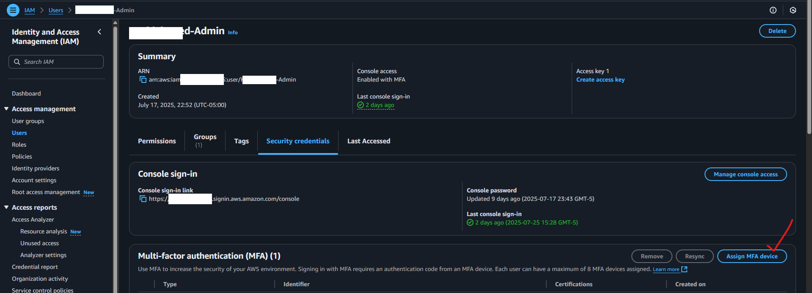

# Hacklab Med: Taller_fundamentos_sec_AWS

## Presentación fundamentos seguridad en AWS: [Aquí](https://hacklab-med-cloud-sec1.my.canva.site/)

## 쯈ué hicimos en el taller, parte 1?

En esta primera parte, creamos una cuenta de AWS para el lan y tomamos acciones para asegurarla: **Lo primero que deberíamos hacer siempre al crear una cuenta de AWS**.

### 1. Creamos una cuenta gratuita de AWS

[Desde aquí](https://aws.amazon.com/es/free/)

Necesitarás un correo, número celular y tarjeta de crédito válidos para esto. Yo usé:

- Mi # celular de siempre
- Creé un nuevo correo de gmail porque el mío ya estaba asociado a una cuenta de AWS y esto impide usarlo para una cuenta nueva.
- Saqué una nueva TC virtual por Nu\* en minutos.
  - \*publicidad política no pagada :D. Realmente lo cuento para que veas que toma minutos (cuando funciona\*\* xD)

Selecciona el plan gratuito durante el proceso de creación de la cuenta y asegúrate de entender lo que pasará en 6 meses 🙂:

En minutos deberías recibir este correo (guárdalo, lo necesitarás luego), si el proceso de creación finalizó bien\*\*. Dale clic donde se muestra y entra como usuario root (con el email donde recibiste este correo):

> **Nota:** Problemas comunes incluyen: que AWS te diga que tu correo ya está asociado a una cuenta de AWS, en ese caso, crea un nuevo correo y trata con ese. Que el número no es válido (aún cuando lo es), en ese caso, prueba con otro número o contacta a soporte de AWS.

---

### 2. Pusimos en negro la interfaz

Por la seguridad... de nuestros ojitos :D

---

### 3. Desplegamos configs básicas de seguridad en la cuenta usando CloudFormation (CFN)

#### 3.1. Descargamos esta [plantilla](https://static.us-east-1.prod.workshops.aws/public/d26ed443-f89d-4e11-8c40-8b75df543bab/static/resources/cfn.yaml)... un .yml definido por AWS con configs básicas de seguridad para cuentas nuevas.

#### 3.2. Como root, cargamos el .yml a CloudFormation, nombramos el stack `security-baseline` y la desplegamos usando estos parámetros:

#### Esta plantilla, con estos parámetros automáticamente hace esto en nuestra cuenta de AWS:

- Crea un usuario Admin de IAM y un grupo IAM de Admins (**El costo de este control es gratis**)
- Configura una alarma que nos avisa por correo cuando los consumos de la cuenta superen el 1% ($0.01) de la cantidad presupuestada en el parámetro BillingThreshold ($1.00) (**El costo de este control es gratis**)
- Configura una alarma que nos avisa si se inicia sesión con la cuenta root (**El costo de este control es gratis**)
- Despliega un bucket de S3 para guardar los logs de CloudTrail más allá de los 3 meses que ofrece gratis sin configurarle nada (**El costo de este control NO es gratis**)

  - **Aunque es poco, [AWS dice esto](https://catalog.workshops.aws/startup-security-baseline/en-US/b-securing-your-account/b1-automateddeployment/0-automateddeployment#cost):**

    > Almacenar registros en S3 generará algunos costos. Estimando 5,000 llamadas API por día para una sola cuenta de AWS y cada llamada API genera 3KB de registros, un mes de registros ocupará 450MB de espacio. En un año, acumularás aproximadamente 5.4GB de registros... [que] cuesta alrededor de $0.023 por GB por mes. Por lo tanto, el costo de los registros después de un año será de 12 centavos al mes, o aproximadamente $1.50 por año

    Esto tuvimos que activarlo al lanzar la plantilla (con el parámetro `ShouldDeployCloudTrail=true`) porque vimos en el lab que daba error si no se activaba. Pero puedes evitar los costos borrando manualmente desde tu consola de AWS:

    - el trail creado desde `CloudTrail/Trails/ManagementEventsTrail/Delete`
    - el bucket llamado `security-baseline-s3bucketforcloudtrailcloudtrail-...`

---

### 4. Validamos que la info de contactos de la cuenta fuera correcta

#### 4.1. Email de root:

Asegúrate de que el correo electrónico de root esté vinculado a una dirección de correo electrónico activa (debería ser la misma con la que abriste tu cuenta).

> En la vida real, este email debería ser un alias/correo genérico administrado por tu equipo de cloud, en lugar de un correo asociado a una sola persona. Por ejemplo, cloud@MiEmpresa.com es una buena idea, pero cristian@MiEmpresa.com no... porque se va cristian, eliminan su email y pierdes tu root :(

**El costo de este control es gratis**

#### 4.2. Contactos alternos

Actualiza tus contactos alternativos para asegurarte de que los equipos/personas correctas reciban notificaciones relacionadas con Facturación, Operaciones y Seguridad.

> Para este taller, no es necesario configurarlos, pero, igual que con el email de root, en la vida real todos los emails acá deberían configurarse como alias que no dependan de una sola persona. Por ejemplo: El contacto de seguridad puede ser security@MiEmpresa.com, en lugar de uno asociado a una sola persona como El-Man-De-Seguridad@MiEmpresa.com.

**El costo de este control es gratis**

---

### 5. Protegimos el root

El [Estándar CIS de Seguridad de AWS](https://docs.aws.amazon.com/securityhub/latest/userguide/securityhub-controls-reference.html) recomienda no utilizar el root para tareas cotidianas, incluyendo aquellas de tipo administrativo. Este usuario debe usarse exclusivamente para: gestionar temas de facturación, modificar los contactos alternativos.

Para todas las demás operaciones, usa usuarios, roles u otras identidades de IAM.

#### 5.1. Revisar que no haya Access Keys asociadas al root

En el pasado, al crear la cuenta, AWS creaba una Access Key asociada al root. Ahora, ya no lo hace, pero si tienes una cuenta creada antes de 2023, es posible que aún tengas una Access Key asociada al root. Si es así, elimínala... No se necesita para nada y es un riesgo de seguridad (que el mismo AWS introducía en cada nueva cuenta).

**El costo de este control es gratis**

#### 5.2. Configurar MFA para el root

y sigues el paso a paso... necesitarás instalar una app como Google Authenticator en tu celu.

A estas alturas de la vida, creo que sobra decir por qué debemos usar MFA en el root (y en cualquier identidad de IAM), así que no lo haré... Pero acá va un **pro-tip dado por AWS**:

> Lo ideal (en la vida real) es que el MFA y la contraseña _de root_ la tengan 2 personas diferentes (una la contra, la otra el MFA). Esto evita que una sola persona pueda utilizar la cuenta raíz.

**El costo de este control es gratis**

---

#### 6. Configurar MFA para el admin de la cuenta

y sigue el paso a paso...

> A partir de este momento deberías cerrar sesión de root y entrar a tu cuenta con el usuario admin.

**El costo de este control es gratis**

---

## Continuaremos con la parte 2 del taller en una próxima sesión de Hacklab Medellín :) happy hacking!
